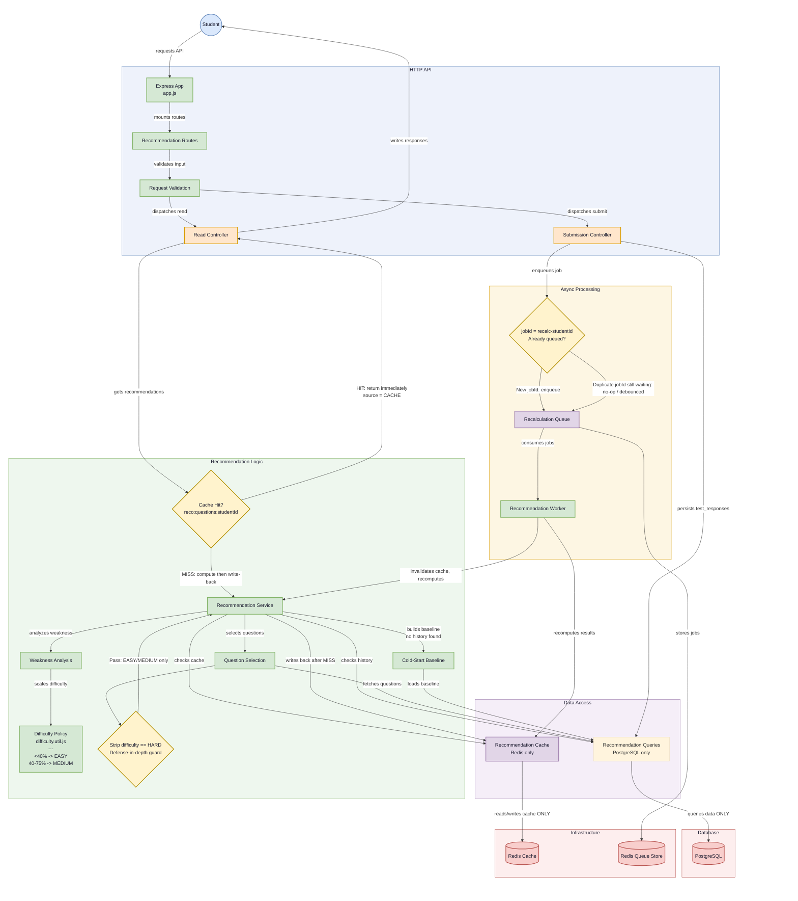

```mermaid
%%{init: {'theme': 'base', 'themeVariables': { 'lineColor': '#333333', 'textColor': '#1a1a2e', 'edgeLabelBackground': '#ffffff' }}}%%
graph TD

    subgraph Background [ ]
        direction TD

        Student((Student))

        subgraph HTTPAPI["HTTP API"]
            AppJS[Express App<br/>app.js]
            Routes[Recommendation Routes]
            Validate[Request Validation]
            ReadCtrl[Read Controller]
            SubmitCtrl[Submission Controller]
        end

        subgraph AsyncProcessing["Async Processing"]
            Worker[Recommendation Worker]
            Queue[Recalculation Queue]
            JobIdCheck{"jobId = recalc-studentId<br/>Already queued?"}
        end

        subgraph RecoLogic["Recommendation Logic"]
            RecoService[Recommendation Service]
            CacheGate{"Cache Hit?<br/>reco:questions:studentId"}
            WeaknessAnalysis[Weakness Analysis]
            DiffPolicy["Difficulty Policy<br/>difficulty.util.js<br/>---<br/>&lt;40% -&gt; EASY<br/>40-75% -&gt; MEDIUM"]
            QuestionSelection[Question Selection]
            HardFilter{"Strip difficulty == HARD<br/>Defense-in-depth guard"}
            ColdStart[Cold-Start Baseline]
        end

        subgraph DataAccess["Data Access"]
            Cache[Recommendation Cache<br/>Redis only]
            Queries[Recommendation Queries<br/>PostgreSQL only]
        end

        subgraph Database["Database"]
            Postgres[(PostgreSQL)]
        end

        subgraph Infrastructure["Infrastructure"]
            RedisCache[(Redis Cache)]
            RedisQueue[(Redis Queue Store)]
        end

        Student -->|requests API| AppJS
        AppJS -->|mounts routes| Routes
        Routes -->|validates input| Validate
        Validate -->|dispatches read| ReadCtrl
        Validate -->|dispatches submit| SubmitCtrl

        ReadCtrl -->|gets recommendations| CacheGate
        CacheGate -->|"HIT: return immediately<br/>source = CACHE"| ReadCtrl
        CacheGate -->|"MISS: compute then write-back"| RecoService
        ReadCtrl -->|writes responses| Student

        SubmitCtrl -->|persists test_responses| Queries
        SubmitCtrl -->|enqueues job| JobIdCheck
        JobIdCheck -->|"New jobId: enqueue"| Queue
        JobIdCheck -->|"Duplicate jobId still waiting: no-op / debounced"| Queue

        Queue -->|stores jobs| RedisQueue
        Queue -->|consumes jobs| Worker
        Worker -->|invalidates cache, recomputes| RecoService
        Worker -->|recomputes results| Cache

        RecoService -->|checks history| Queries
        RecoService -->|analyzes weakness| WeaknessAnalysis
        WeaknessAnalysis -->|scales difficulty| DiffPolicy
        RecoService -->|selects questions| QuestionSelection
        QuestionSelection -->|fetches questions| Queries
        QuestionSelection --> HardFilter
        HardFilter -->|"Pass: EASY/MEDIUM only"| RecoService
        RecoService -->|builds baseline<br/>no history found| ColdStart
        ColdStart -->|loads baseline| Queries
        RecoService -->|checks cache| Cache
        RecoService -->|writes back after MISS| Cache

        Cache -->|reads/writes cache ONLY| RedisCache
        Queries -->|queries data ONLY| Postgres
    end

    style Background fill:#ffffff,stroke:#ffffff,color:#ffffff

    classDef entity fill:#dae8fc,stroke:#6c8ebf,stroke-width:2px,color:#1a1a2e
    classDef controller fill:#ffe6cc,stroke:#d79b00,stroke-width:2px,color:#1a1a2e
    classDef process fill:#d5e8d4,stroke:#82b366,stroke-width:2px,color:#1a1a2e
    classDef cacheNode fill:#e1d5e7,stroke:#9673a6,stroke-width:2px,color:#1a1a2e
    classDef database fill:#f8cecc,stroke:#b85450,stroke-width:2px,color:#1a1a2e
    classDef decision fill:#fff3cd,stroke:#b38f00,stroke-width:2px,color:#1a1a2e

    class Student entity
    class ReadCtrl,SubmitCtrl controller
    class AppJS,Routes,Validate,RecoService,WeaknessAnalysis,DiffPolicy,QuestionSelection,ColdStart,Worker process
    class Cache,Queue cacheNode
    class Postgres,RedisCache,RedisQueue database
    class CacheGate,HardFilter,JobIdCheck decision

    style HTTPAPI fill:#eef2fb,stroke:#6c8ebf,stroke-width:1px,color:#1a1a2e
    style AsyncProcessing fill:#fdf6e3,stroke:#d79b00,stroke-width:1px,color:#1a1a2e
    style RecoLogic fill:#eef7ee,stroke:#82b366,stroke-width:1px,color:#1a1a2e
    style DataAccess fill:#f5eef8,stroke:#9673a6,stroke-width:1px,color:#1a1a2e
    style Database fill:#fdeeee,stroke:#b85450,stroke-width:1px,color:#1a1a2e
    style Infrastructure fill:#fdeeee,stroke:#b85450,stroke-width:1px,color:#1a1a2e
```